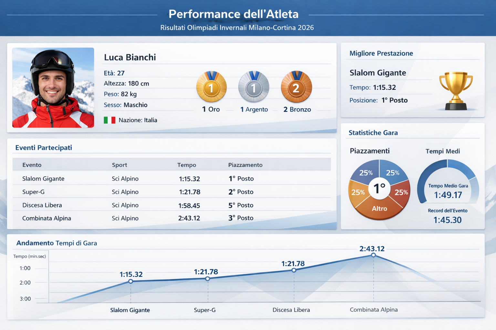
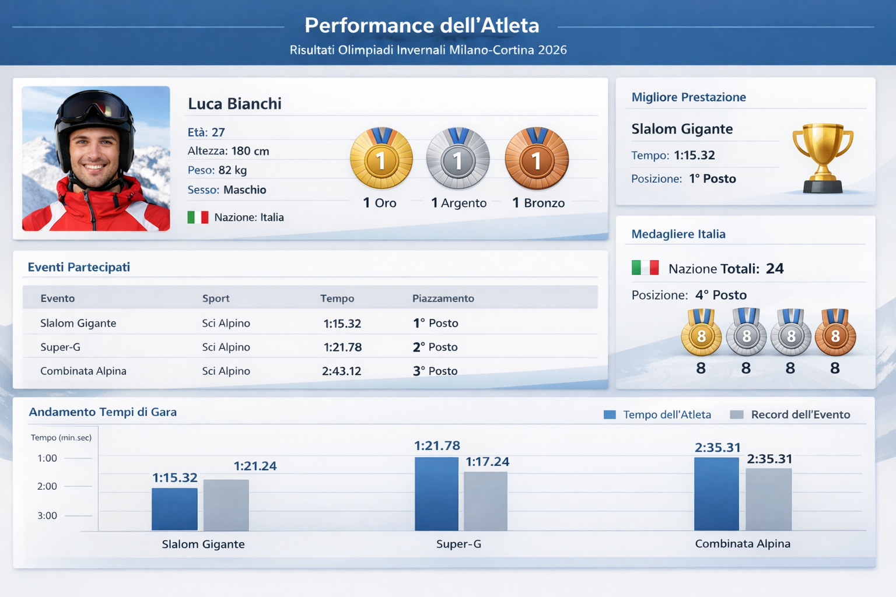
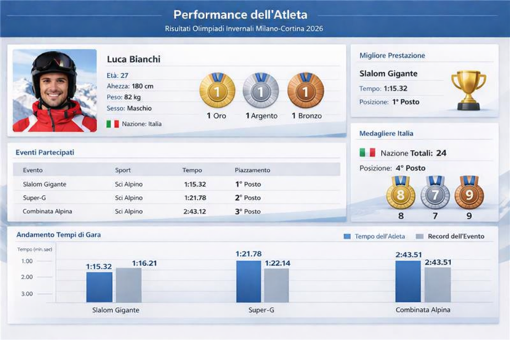
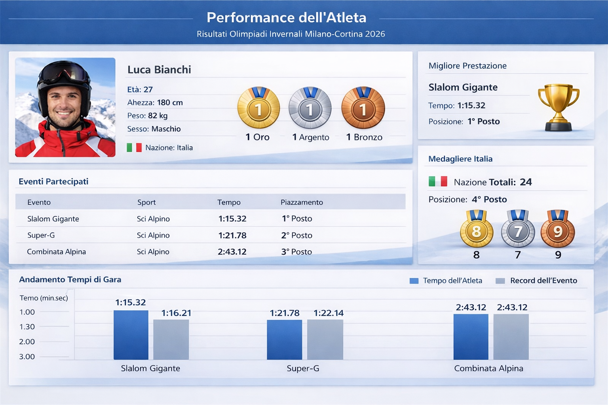
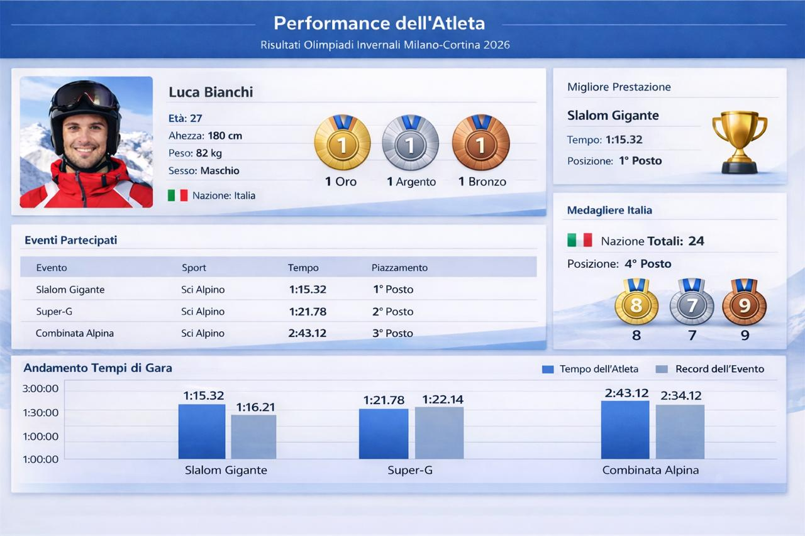
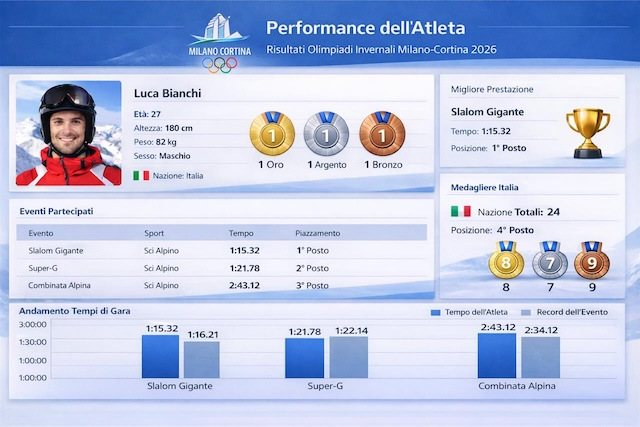

## Prompt 1
Nazione: id_nazione (PK), nome, bandiera, continente, tot_medaglie_bronzo, tot_medaglie_argento, tot_medaglie_oro   
Atleta: id_atleta (PK), nome, cognome, età, altezza, peso, sesso, id_nazione   
Partecipazione: id_partecipazione (PK), id_atleta, id_evento, tempo, piazzamento    
Evento: id_evento (PK), nome, sport, record_maschile, record_femminile     

Un Atleta può avere una sola Nazione   
Ogni Nazione può avere più Atleti   

Un Atleta può avere più Partecipazioni     
Ogni Partecipazione è relativa a un Atleta 

Ogni Evento può avere più Partecipazioni     
Ogni Partecipazione è relativa a un Evento      

Supponiamo di avere uno schema logico organizzato come detto, relativo alle Olimpiadi Invernali di Milano-Cortina 2026. D’ora in avanti ti chiederò di generarmi delle immagini di dashboard per una web app su questo argomento, facendo sempre riferimento a questo schema logico.    
Crea una dashboard sulle prestazioni di un atleta con le statistiche registrate durante l’Olimpiade, in modo coerente allo schema logico.    
### Risultato:

## Prompt 2
Esegui le seguenti migliorie:  
- C’è un errore di coerenza in eventi partecipati perchè hai messo sopra 2 medaglie di bronzo e invece hai messo che nella discesa libera l’atleta si è posizionato quinto,
perciò risolvi questo.  
- Rimuovi la sezione Statistiche Gara e rimpiazzala con un’infografica relativa al medagliere della propria nazione.  
- Modifica il grafico Andamento tempi gara in un grafico a barre con ogni evento in cui si vede il tempo dell’atleta e il record relativo di quell’evento. 
### Risultato:

## Prompt 3
Questa dashboard è migliore, esegui queste modifiche in modo da renderla perfetta:   
- Nel grafico Andamento Tempi di Gara, non è possibile che l’atleta abbia battuto il record di 6 secondi. Inoltre, nella Combinata Alpina hai sbagliato il tempo dell’atleta che non corrisponde con quello nella tabella.
- Migliora il medagliere, in particolare hai messo due volte l’icona della medaglia d’argento e non va bene.
### Risultato:

## Prompt 4
Il risultato è quasi soddisfacente. Il problema principale è sul grafico 'Andamento tempi di gara': i valori sull’asse delle ordinate sono incoerenti con i valori delle altezze delle barre delle 3 discipline e l’ordine dei valori dovrebbe essere crescente verso l’alto. Inoltre nel ’Super G’ un tempo minore ha una barra piu alta del record che è maggiore (dovrebbe essere più bassa) e nella combinata alpina i due tempi sono uguali ma una barra è più alta dell’altra. In più il valore del tempo della combinata alpina visualizzato in questo grafico (2:43:51) è diverso da quello in
'Eventi principali' (2:43:12).       
Applica tutte queste modifiche nel grafico ’Andamento tempi di gara’ senza toccare gli altri grafici.
### Risultato:

## Prompt 5
Devi modificare ancora 'Andamento tempi di gara' (grafico in basso) in questo modo:
- Asse delle ordinate: valori da 1:00:00 (1 minuto) a 3:00:00 (3 minuti), partendo dall’origine del grafico in basso col valore MINORE, andando a crescere verso l’alto.
- Slalom gigante: l’atleta in questa disciplina è arrivato 1°, quindi fai la barra del suo tempo leggermente più bassa della barra del record.
- Super-G: qui devi fare la barra del tempo dell’atleta leggermente più alta della barra dell’atleta per lo Slalom gigante, ma PIU' BASSA della barra del record del
Super-G (perche qui l’atleta è arrivato secondo e non può avere un tempo record).
- Combinata alpina: qui è arrivato terzo, quindi la barra del record deve essere MOLTO più bassa di quella del tempo dell’atleta. Entrambe queste barre però devono essere più alte delle barre degli altri sport (perchè nella combinata i tempi sono più lunghi).   

PIU' BASSO NEL GRAFICO = MENO TEMPO.    

Modifica l’ultimo grafico Andamento tempi di gara SENZA MODIFICARE NULLA di tutto il resto della dashboard.
### Risultato:

## Prompt 6
Adesso migliora il titolo mettendo il logo delle Olimpiadi per rendere la grafica coerente con lo stile moderno delle Olimpiadi invernali. Concentrati solo sull'estetica.
### Risultato:

