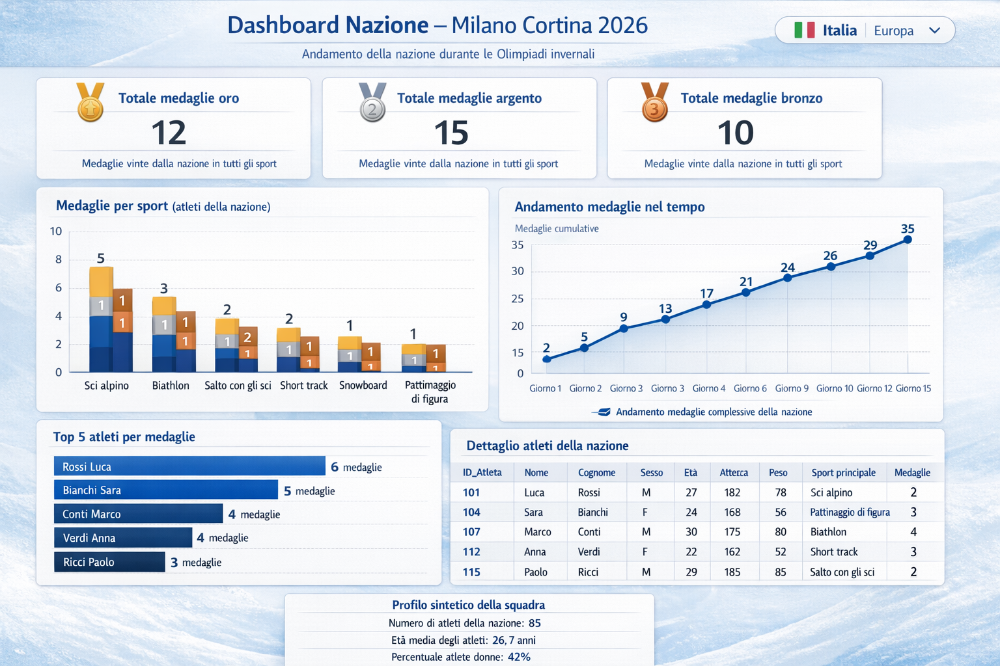
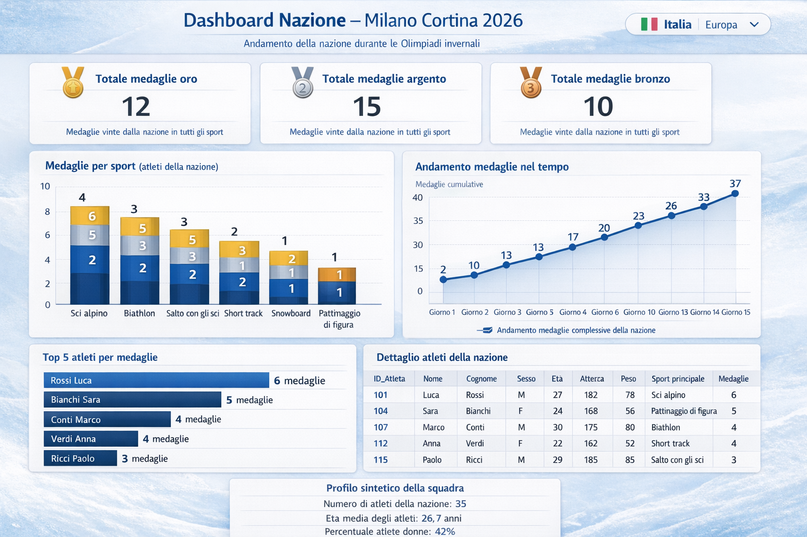
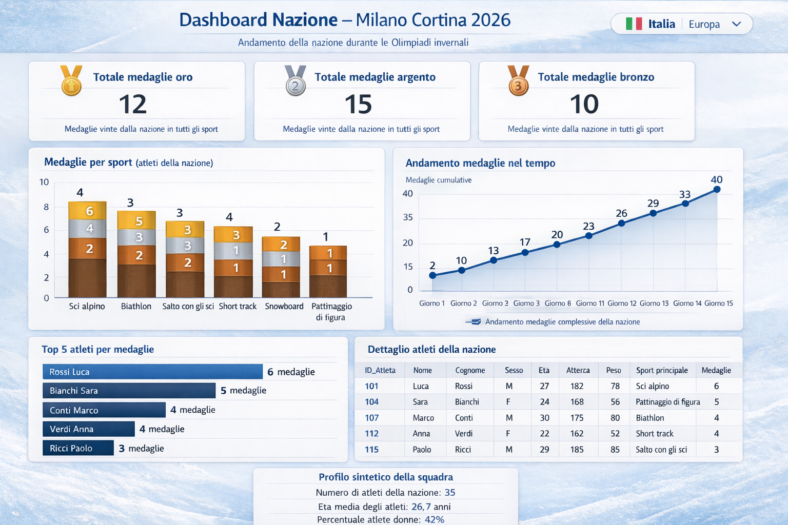
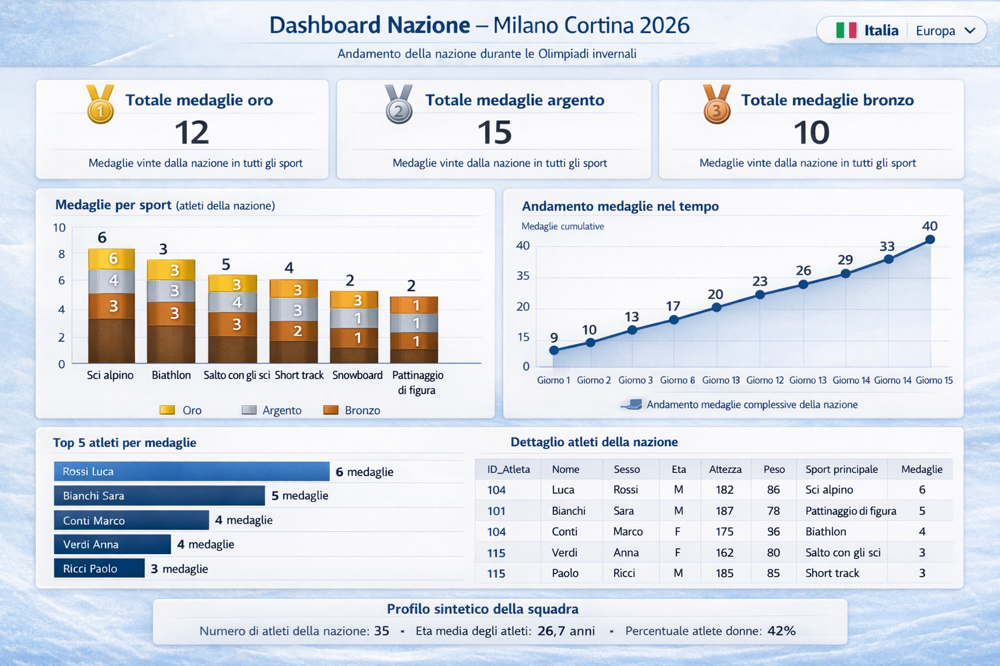

## Prompt 1
Crea un’immagine ad alta risoluzione (1920x1080) di una dashboard olimpica intitolata “Dashboard Nazione – Milano Cortina 2026”, progettata da un data analyst professionista. La dashboard deve basarsi esclusivamente sul seguente schema logico dei dati (NON aggiungere altri attributi non presenti):   
Nazione: id_nazione (PK), nome, bandiera, continente, tot_medaglie_bronzo, tot_medaglie_argento, tot_medaglie_oro     
Atleta: id_atleta (PK), nome, cognome, età, altezza, peso, sesso, id_nazione     
Partecipazione: id_partecipazione (PK), id_atleta, id_evento, tempo, piazzamento    
Evento: id_evento (PK), nome, sport, record_maschile, record_femminile    

La dashboard deve essere focalizzata su UNA sola NAZIONE (ad esempio “Italia”) e mostrare solo informazioni coerenti con questi attributi e con le relazioni (per esempio aggregando le Partecipazioni degli atleti di quella nazione sugli Eventi). NON inserire mappe geografiche, indirizzi, città o altri dati di localizzazione.    
Stile grafico:    
- Design moderno e pulito, sfondo chiaro ispirato all’estetica delle Olimpiadi invernali (toni freddi con accenti vivaci).
- Palette di colori accattivante: azzurro ghiaccio, blu scuro, bianco, con accenti arancione/rosso per evidenziare le medaglie.
- Font sans-serif leggibile, con gerarchie chiare (titolo molto grande, sottotitoli medi, testi tabellari più piccoli ma leggibili).
- Allineamenti ordinati, margini regolari, box con angoli leggermente arrotondati, aspetto da applicazione BI professionale.     

Layout (disposto in griglia, tutto in un’unica schermata, vista frontale):
1.	Header in alto
- Titolo grande centrato: “Dashboard Nazione – Milano Cortina 2026”.
- Sottotitolo più piccolo: “Andamento della nazione durante le Olimpiadi invernali”.
- A destra inserisci un selettore di nazione stilizzato con il nome della nazione (es. “Italia”) e un piccolo indicatore di continente (solo testo, es. “Europa”).
2.	Riquadri KPI in alto (3 box affiancati)
Tutti i KPI devono mostrare numeri ben leggibili (interi) e un’etichetta chiara in italiano.
- KPI 1: “Totale medaglie oro” – mostra il valore di Nazione.tot_medaglie_oro.
- KPI 2: “Totale medaglie argento” – mostra Nazione.tot_medaglie_argento.
- KPI 3: “Totale medaglie bronzo” – mostra Nazione.tot_medaglie_bronzo.
Sotto ogni numero, inserisci una piccola descrizione testuale, ad esempio “Medaglie vinte dalla nazione in tutti gli sport”.
3.	Grafico a barre verticali “Medaglie per sport” (parte sinistra centrale)
- Usa i dati derivati da Partecipazione e Evento: conta quante medaglie (piazzamento = 1, 2 o 3) sono state vinte dagli atleti della nazione in ciascuno sport (Evento.sport).
- Asse X: elenca 6–8 sport plausibili in italiano (es. “Sci alpino”, “Biathlon”, “Salto con gli sci”, “Short track”, “Snowboard”, “Pattinaggio di figura”).
- Asse Y: numero di medaglie.
- Barre impilate per tipo di medaglia: oro, argento, bronzo (tre colori diversi coerenti con la palette).
- Ogni barra deve avere un’etichetta numerica sopra (es. “5”, “3”, “1”).
- Titolo chiaro sopra il grafico: “Medaglie per sport (atleti della nazione)”.
4.	Grafico a linee “Andamento medaglie nel tempo” (parte destra centrale)
- Mostra il numero cumulativo di medaglie ottenute dalla nazione lungo i giorni dell’Olimpiade.
- Asse X: sequenza di giorni numerati dell’evento (es. “Giorno 1”, “Giorno 2”, … “Giorno 15”), in italiano.
- Asse Y: medaglie cumulative totali.
- Linea continua con punti marcati per ogni giorno; ogni punto deve avere un’etichetta numerica vicina (valore cumulativo).
- Aggiungi una piccola legenda: “Andamento medaglie complessive della nazione”.
5.	Grafico a barre orizzontali “Top 5 atleti della nazione” (in basso a sinistra)
- Ogni barra rappresenta un atleta di quella nazione, costruito combinando Atleta.nome e Atleta.cognome.
- Criterio: ordina per numero di medaglie vinte (conteggio di Partecipazione con piazzamento 1–3).
- Asse Y: testo “Cognome Nome” (es. “Rossi Luca”, “Bianchi Sara”).
- Asse X: numero di medaglie o un punteggio sintetico (ad esempio “Medaglie totali”).
- Alla fine di ogni barra scrivi il valore numerico (es. “3 medaglie”).
- Titolo del grafico: “Top 5 atleti per medaglie”.
6.	Tabella “Dettaglio atleti della nazione” (in basso a destra)
- Deve essere chiaramente leggibile e NON tagliare i testi.
- Colonne (in questo ordine): ID_Atleta, Nome, Cognome, Sesso, Età, Altezza, Peso, Sport principale, Medaglie.
- “Sport principale” deriva dallo sport in cui l’atleta ha più Partecipazioni (usa il valore Evento.sport).
- “Medaglie” è il numero totale di medaglie ottenute dall’atleta (conteggio Partecipazione con piazzamento 1–3).
- Popola la tabella con 6–8 righe fittizie ma realistiche, ad esempio: “ID_Atleta: 101”, “Nome: Luca”, “Cognome: Rossi”, “Sesso: M”, “Età: 27”, “Altezza: 182”, “Peso: 78”, “Sport principale: Sci alpino”, “Medaglie: 2”.
- Alterna leggermente il colore di sfondo delle righe (righe zebrate) per migliorare la leggibilità.
- Allinea i testi in modo ordinato, numeri a destra, testi a sinistra.
7.	Piccolo riquadro di sintesi in basso (centrato)
- Titolo: “Profilo sintetico della squadra”.
- Inserisci 2–3 frasi testuali, basate sugli attributi dello schema, ad esempio:
"Numero di atleti della nazione: 85".
"Età media degli atleti: 26,7 anni".
"Percentuale atlete donne: 42\%".
- Usa solo testo e numeri, senza grafici aggiuntivi.    

Vincoli importanti:
- NON inserire mappe o qualunque elemento geografico (puoi usare solo il testo del continente).
- NON inserire attributi non presenti nello schema logico (niente indirizzi, città, numero di telefono, ecc.).
- NON tagliare testi nelle tabelle o nelle etichette delle barre: tutto il testo deve essere pienamente leggibile.
- Tutte le etichette numeriche dei grafici (assi, valori sulle barre, KPI) devono essere chiare e ben visibili.
- Usa etichette, titoli e testi SOLO in lingua italiana.
- Evita qualsiasi testo generico come “Lorem ipsum”: usa sempre valori numerici e nomi plausibili per atleti, sport e nazioni.   

Mostra la dashboard completa in un’unica schermata, vista frontale, come se fosse lo screenshot di un’applicazione di Business Intelligence professionale dedicata alle Olimpiadi invernali Milano Cortina 2026.
### Risultato:

## Prompt 2
Correggi questa dashboard “Dashboard Nazione – Milano Cortina 2026” mantenendo lo stesso layout generale, lo stesso stile grafico, gli stessi testi in italiano e gli stessi colori, ma risolvendo in modo rigoroso tutti i problemi di consistenza dei dati, spaziatura e leggibilità descritti di seguito. Non cambiare il numero dei box, né la struttura logica della pagina: limita gli interventi a correzioni, riallineamenti e piccoli ridimensionamenti.    

1. Coerenza tra KPI e grafico “Medaglie per sport”.
I tre KPI in alto mostrano:
- Totale medaglie oro = 12
- Totale medaglie argento = 15
- Totale medaglie bronzo = 10    
Il grafico “Medaglie per sport (atleti della nazione)” deve essere un grafico a barre impilate:
- Una sola barra per ogni sport, non più barre separate; all’interno di ogni barra ci devono essere tre segmenti impilati (oro, argento, bronzo).
- Ogni segmento di colore deve avere il numero della medaglia all’interno (es. 2, 1, ecc.), ben leggibile.
- La somma di tutti i segmenti oro di tutte le barre deve essere esattamente 12.
- La somma di tutti i segmenti argento deve essere 15.
- La somma di tutti i segmenti bronzo deve essere 10.
- In totale il grafico deve rappresentare 37 medaglie, perfettamente coerenti con i KPI.
- Correggi l’etichetta dello sport: scrivi esattamente “Pattinaggio di figura” (non “Pattimaggio” o simili).
2. Coerenza tra KPI e “Andamento medaglie nel tempo”. Nel grafico “Andamento medaglie nel tempo” la linea deve arrivare a un valore finale di 37 (non 35), perché deve rappresentare il totale complessivo delle medaglie (oro + argento + bronzo) mostrato dai KPI.     
Ridistribuisci i valori intermedi in modo plausibile, ma assicurati che:
- Ogni punto sia maggiore o uguale al precedente (serie cumulativa).
- L’ultimo punto sia esattamente 37.
- Mantieni lo stile del grafico, la linea blu e le etichette “Giorno 1, Giorno 2, …”.
3. Coerenza tra grafico “Top 5 atleti per medaglie” e tabella “Dettaglio atleti della nazione”. I nomi degli atleti (es. “Rossi Luca”, “Bianchi Sara”, “Conti Marco”, “Verdi Anna”, “Ricci Paolo”) devono essere perfettamente coerenti:
- Se un atleta ha “6 medaglie” nel grafico a barre “Top 5 atleti per medaglie”, allora nella tabella “Dettaglio atleti della nazione” la colonna Medaglie per lo stesso atleta deve riportare lo stesso numero.    
Allinea tutti i valori: non devono esserci discrepanze tra il grafico di sinistra e la tabella di destra.    
Mantieni i valori numerici plausibili ma coerenti; correggi solo dove c’è incoerenza.
4. Testi, colori e leggibilità nella tabella. Nella colonna “Sport principale” della tabella “Dettaglio atleti della nazione”, la voce “Pattinaggio di figura” deve:
- Essere scritta per intero, senza essere tagliata ai bordi della cella.
- Avere il testo in nero, come il resto dei valori della tabella (non in blu).
- Se necessario, allarga leggermente la colonna “Sport principale” o riduci di pochissimo la dimensione del font per evitare ogni taglio di testo.
- Mantieni la tabella ben allineata, con righe zebrate chiare e tutte le etichette leggibili.
5. Riquadro “Profilo sintetico della squadra” e centratura generale. Il riquadro in basso “Profilo sintetico della squadra” deve essere completamente visibile, non tagliato:
- Ridimensiona leggermente la sua altezza o la dimensione del font, oppure aumenta di poco lo spazio inferiore, in modo che tutto il testo entri perfettamente nella dashboard senza essere troncato.
- Centra il riquadro rispetto alla larghezza della pagina, così da risultare ben allineato con gli elementi sopra.
Rivedi il centraggio complessivo della dashboard:
- Tutte le sezioni (KPI, grafici, tabella e riquadro di sintesi) devono essere allineate in una griglia ordinata, con margini regolari e spaziature uniformi tra i box.
6. Altri controlli e vincoli generali. Verifica che tutti i numeri, etichette di assi, titoli e descrizioni siano perfettamente leggibili e non tagliati.    
Mantieni tutti i testi in lingua italiana, senza usare “Lorem ipsum” o testo generico.   
Non aggiungere nuove visualizzazioni, non cambiare il tema grafico e non introdurre nuovi campi dati: lavora solo sulla correzione di consistenza, ortografia, colori, spazi e allineamenti.   

Genera l’immagine finale come se fosse lo screenshot pulito e corretto della stessa dashboard di Business Intelligence, ma con tutte le incongruenze risolte.
### Risultato:

## Prompt 3
Prendi l’ultima immagine generata della dashboard “Dashboard Nazione – Milano Cortina 2026” e applica SOLO le seguenti correzioni puntuali, mantenendo invariato layout, testi, font, stile grafico e colori di sfondo.
1. Grafico “Medaglie per sport (atleti della nazione)”. Il grafico deve usare esclusivamente tre colori per le medaglie: oro, argento, bronzo.     
Elimina ogni altro colore (in particolare il blu usato come segmento separato dentro le barre): L’unico blu ammesso è l’eventuale colore del bordo o dell’asse, non un quarto segmento di barra.     
Ogni barra per sport deve essere una barra impilata con solo tre segmenti (oro, argento, bronzo), con il numero della medaglia all’interno del segmento.    
Controlla di nuovo la somma delle medaglie: 
- Somma di tutti i segmenti oro = 12
- Somma di tutti i segmenti argento = 15
- Somma di tutti i segmenti bronzo = 10    
Se necessario, ridistribuisci i numeri per sport, ma assicurati che il totale complessivo rappresentato dal grafico sia esattamente 37 medaglie, coerente con i KPI.
2. Grafico “Andamento medaglie nel tempo”. Mantieni gli stessi valori cumulativi già mostrati (fino a 37), ma correggi la scala sull’asse Y:
- L’asse Y deve partire da 0 e arrivare leggermente sopra 37 (ad esempio 40), con tacche regolari.
- I valori dei punti devono essere coerenti con questa scala: il punto finale a 37 deve trovarsi vicino alla parte alta dell’area del grafico, non sotto il limite massimo.
- Verifica che tutte le etichette numeriche sull’asse Y siano leggibili e correttamente posizionate rispetto alla griglia.
3. Riquadro “Profilo sintetico della squadra”. Il riquadro “Profilo sintetico della squadra” in basso deve essere completamente visibile e non tagliato:
- Aumenta leggermente lo spazio verticale in basso, oppure riduci di poco l’altezza del riquadro e la dimensione dei testi, in modo che tutto il contenuto del box (titolo e tre righe di testo) sia pienamente leggibile dentro la dashboard, senza bordi tagliati.
- Centra orizzontalmente il riquadro rispetto alla pagina, mantenendo margini simmetrici a sinistra e a destra.
4. Vincoli finali:
- Non modificare i valori dei KPI, i nomi degli atleti o degli sport, né la struttura generale della dashboard.
- Non introdurre nuovi elementi grafici: limita l’intervento alle correzioni richieste su colori, somme delle medaglie, scala delle ordinate e visibilità del riquadro in basso.

Rigenera l’immagine come se fosse la stessa dashboard, ma con queste correzioni applicate in modo preciso.
### Risultato:

## Prompt 4
Prendi questa immagine della dashboard “Dashboard Nazione – Milano Cortina 2026” e applica SOLO le seguenti modifiche, mantenendo lo stesso stile grafico, font, colori e testi in italiano.
1. Riquadro “Profilo sintetico della squadra” (in basso). Mantieni il riquadro nella stessa posizione orizzontale e verticale, ma cambiane l’impaginazione interna per renderlo più sottile in altezza e sviluppato in orizzontale.     
Struttura il contenuto così:
- Titolo “Profilo sintetico della squadra” centrato in alto nel riquadro.
- Sotto il titolo, su un’unica riga orizzontale, allinea da sinistra verso destra le tre informazioni, separate da ampio spazio:     
“Numero di atleti della nazione: 35”     
“Età media degli atleti: 26,7 anni”     
“Percentuale atlete donne: 42%”     
- Riduci leggermente l’altezza del box in modo che si veda chiaramente il bordo inferiore del riquadro e la chiusura della dashboard, senza che il contenuto sia tagliato.
2. Grafico “Medaglie per sport (atleti della nazione)”. Correggi la struttura delle barre:
- Rimuovi completamente la base uniforme in marrone scuro alla base delle barre.
- Ogni barra deve essere composta solo dai tre segmenti impilati corrispondenti alle medaglie: oro, argento, bronzo (tre colori, nessun altro segmento).
- Rimuovi i numeri blu sopra le barre (4, 3, 3, 4, 2, 1):
Devono scomparire del tutto; le uniche etichette numeriche devono essere quelle all’interno dei segmenti oro/argento/bronzo.
- Controlla la coerenza dei valori:    
Somma di tutti i segmenti oro = 12    
Somma di tutti i segmenti argento = 15    
Somma di tutti i segmenti bronzo = 10    
- Se necessario, ridistribuisci le medaglie tra gli sport, ma il totale complessivo del grafico deve essere 37 medaglie, coerente con i KPI.
3. Grafico “Andamento medaglie nel tempo”. Mantieni la linea blu e le etichette “Giorno 1, Giorno 2, …”, ma correggi la coerenza tra valori dei punti e scala dell’asse Y.     
L’asse Y deve rappresentare correttamente i valori mostrati (fino a 40):   
- I punti con valori 10, 13, 17, 20, 23, 26, 29, 33, 40 devono essere posizionati in modo proporzionale rispetto alle tacche numeriche dell’asse Y.
- Nessun punto deve sembrare più alto o più basso rispetto al valore indicato dalla griglia (es. il punto 40 deve trovarsi sul livello massimo della scala).
- Non cambiare i numeri dei punti, solo la posizione verticale per rispettare la scala.
4. Centratura generale e KPI in alto. Centra meglio l’intera struttura della dashboard:
- Il blocco con i tre KPI in alto (oro, argento, bronzo) deve essere perfettamente centrato orizzontalmente rispetto alla larghezza della dashboard.
- Allinea i tre box KPI in modo che abbiano margini simmetrici a sinistra e a destra e spaziature uniformi tra loro.
- Verifica che anche i due grafici centrali e il blocco inferiore (Top 5 atleti, Dettaglio atleti, Profilo sintetico) risultino allineati in una griglia pulita, con colonne verticali coerenti.
5. Vincoli finali:    
- Non modificare i testi (titoli, nomi di atleti, sport) se non per piccoli aggiustamenti di allineamento.    
- Non cambiare i valori dei KPI (12, 15, 10) e mantieni lo stesso stile complessivo della dashboard.

Rigenera l’immagine come se fosse la stessa dashboard, ma con il riquadro “Profilo sintetico della squadra” sviluppato in orizzontale, il grafico “Medaglie per sport” pulito e coerente, il grafico “Andamento medaglie nel tempo” allineato alla scala e tutti i blocchi ben centrati.
### Risultato:

