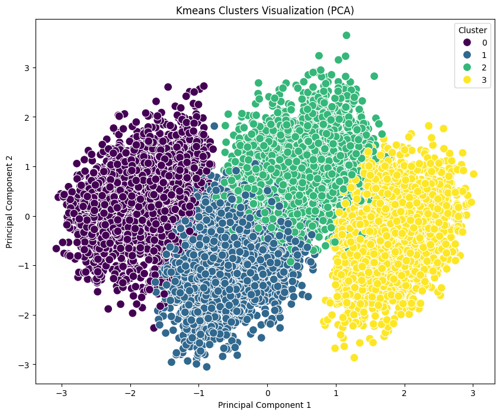

<h1 align="center">Data Science Portfolio</h1>

## Table of Contents <a name="table-of-contents"></a>

1. [**Project Overview**](#projectoverview)

2. [**Folder Structure**](#folderstructure)

3. [**Academic Success Segmentation and Prediction & Energy and Environmental Forecasting**](#project1)

4. [**Social Network Analysis (SNA) of the Marvel Superhero Network**](#project2)

5. [**Conversational AI: Design and Development of "BiblioBot"**](#project3)

6. [**Natural Language Processing (NLP): Sentiment Analysis and Brand Reputation on Twitter (The Dell Case)**](#project4)

7. [**Generative Artificial Intelligence: Technical Evaluation in Software and Visual Development**](#project5)

8. [**Legal**](#legal)
    - [Academic Context](#academiccontext)
    - [License](#license)

## 1. Project Overview <a name="projectoverview"></a>
This repository contains the source code, datasets, Jupyter notebooks, and technical reports for five distinct Data Science projects. These projects were developed as part of the Data Science course (Master's Degree in Computer and Automation Engineering) at **Università Politecnica delle Marche** during the Academic Year 2025-2026. 

The portfolio covers a comprehensive spectrum of advanced analytics, machine learning, and artificial intelligence domains, demonstrating both theoretical understanding and practical implementation skills.

---

## 2. Folder Structure <a name="folderstructure"></a>
```text
Data_science_project/
├─ Chatbot               
│  ├─ data
│  ├─ notebook
│  ├─ rasa_implementation
│  └─ report
├─ Classification Clustering and Time Series               
│  ├─ data
│  ├─ notebooks
│  └─ report
├─ Generative AI              
│  ├─ code_generation
│  ├─ images_generation
│  └─ report
├─ NLP              
│  ├─ data
│  ├─ notebooks
│  └─ report
├─ Social Network Analysis               
│  ├─ data
│  ├─ notebooks
│  └─ report
├─ images
├─ .gitignore
├─ LICENSE
└─ README.md
```
---

## 3. Academic Success Segmentation and Prediction & Energy and Environmental Forecasting <a name="project1"></a>

**Project Description:** This module explores two distinct analytical domains, applying unsupervised learning techniques for **clustering**, supervised **classification** and **time series analysis** to extract predictive patterns from complex datasets.

### Part A: College Student Placement (Clustering & Classification)
The objective of this phase is to profile 10,000 American college students and predict their likelihood of job placement based on cognitive, academic, and soft skills metrics.

* **Exploratory Data Analysis (EDA):** The dataset revealed a strong class imbalance, with only 16.6% of students securing job placement. Correlation analysis highlighted that Cumulative Grade Point Average (CGPA), Intelligence Quotient (IQ), and communication skills are the most discriminating factors.
* **Unsupervised Modeling (Clustering):** K-Means (optimized via the Elbow Method at K=4), DBSCAN (to isolate variable-density clusters and statistical noise), and Hierarchical Clustering (Ward linkage with 6 clusters) algorithms were implemented. Cluster analysis allowed the delineation of distinct student profiles, demonstrating how students characterized by "Academic and Communicative Excellence" achieve employment rates of 46.1%, compared to near-zero percentages for at-risk profiles.
* **Supervised Modeling (Classification):** Multiple classifiers were trained for placement prediction, including Random Forest, SVM (Linear and RBF), Neural Networks (MLP), and boosting algorithms (AdaBoost). Following an optimization process via Grid Search and 5-fold Cross-Validation, non-linear and ensemble models (such as Random Forest and Neural Networks) achieved a predictive accuracy close to 100%. Feature Importance analysis unequivocally confirmed the decisive weight of CGPA and IQ in the models' decision-making processes.
<p align="center">
  <figure>
    
    <figcaption>K-Means result for students clustering</figcaption>
  </figure>
</p>

### Part B: US Electricity Generation & Emissions (Time Series Analysis)
This phase focuses on modeling and forecasting monthly electricity generation and $CO_2$ emissions in the US energy sector, analyzing historical data from 2001 to 2024.

* **Trend and Seasonality Analysis:** Exploratory analysis and additive seasonal decomposition highlighted a strong annual seasonality in electricity demand (with summer and winter peaks) and a progressive transformation of the energy mix, characterized by a sharp reduction in coal in favor of natural gas and renewable sources.
* **Predictive Modeling:** * For **electricity generation**, a SARIMA $(1,0,0)(1,1,0)_{12}$ model was configured, yielding highly accurate forecasts on the test set (2023-2024) and recording a Mean Absolute Percentage Error (MAPE) of just 3.02%.
  * For **carbon dioxide emissions**, a comparative test was conducted between a univariate SARIMA model (MAPE of 6.31%) and a multivariate SARIMAX model. The inclusion of highly correlated exogenous variables (e.g., percentage of generated renewable energy) in the SARIMAX model reduced the error to 1.38% (a 78% reduction).
* **Operational Forecasting:** Official forecasts for the upcoming 2025-2026 biennium were ultimately consolidated using historical models to ensure the stability of projections in the absence of deterministic future exogenous variables.

**Key Technologies & Libraries:**
* **Data Analysis and Visualization:** Python, Pandas, NumPy, Matplotlib, Seaborn, Plotly.
* **Machine Learning & Classification:** Scikit-learn (GridSearchCV, RandomForest, MLP, SVM, KMeans, DBSCAN).
* **Time Series Analysis:** Statsmodels (SARIMA/SARIMAX models, Augmented Dickey-Fuller test).

---

## 4. Social Network Analysis (SNA) of the Marvel Superhero Network <a name="project2"></a>

**Project Description:** This project focuses on the topological and structural analysis of the Marvel Universe, modeled as a complex social network where nodes represent characters (superheroes and villains) and edges define their co-appearances in comic books. The primary objective is to unveil relational dynamics, identify central entities, and assess the resilience of the shared universe's narrative fabric.

**Methodology and Conducted Analysis:**
* **Exploratory Analysis and Network Centrality:** The graph's architecture was examined through the study of multiple centrality metrics to define the specific roles of the characters:
  * *Degree Centrality:* to identify "super-hubs", i.e., characters with the highest absolute number of connections.
  * *Betweenness Centrality:* to discover nodes that act as crucial "bridges", essential for information flow and for connecting different sub-communities (e.g., mutants vs. cosmic heroes).
  * *Closeness and PageRank Centrality:* to evaluate global influence and a character's ability to quickly reach the entire narrative network.
* **Topological Properties (Scale-Free and Small-World):** The analysis confirmed that the Marvel universe exhibits a degree distribution typical of *Scale-Free* networks (with a few highly connected hubs and many peripheral nodes), but simultaneously possesses marked *Small-World* properties, characterized by high local clustering and densely interconnected internal communities.
* **Resilience Assessment (Targeted Attacks):** A crucial focus of the project was testing the network's robustness by simulating "targeted attacks", specifically the sequential removal of major hubs. Contrary to ideal *Scale-Free* networks (which tend to fragment suddenly), the Marvel network showed gradual and controlled structural degradation.
* **Narratological Implications:** Resilience tests demonstrated that the removal of main protagonists does not cause the collapse of the collaborative fabric. This is guaranteed by a strong "structural redundancy" (the presence of numerous intermediate-level hubs) and the high cohesion of local communities. From a narrative perspective, this means the Marvel Universe is robustly designed to continuously generate new story arcs around secondary characters, keeping the global coherence intact.

**Key Technologies & Libraries:**
* **Graph Management and Analysis:** NetworkX (for metric calculation, centrality algorithms, and attack simulation).
* **Data Processing:** Python, Pandas, NumPy.
* **Visualization:** Matplotlib, Seaborn (for distributional analysis and network degradation visualization).

---

## 5. Conversational AI: Design and Development of "BiblioBot" <a name="project3"></a>

**Project Description:** This project illustrates the design, implementation, and deployment of "BiblioBot", a conversational assistant (Chatbot) specialized in the literary domain. The goal is to overcome the limitations of traditional keyword-based search engines (GUI/CLI) by offering users natural language interaction to combat the phenomenon of *information overload*. The system can understand complex requests and suggest readings by dynamically applying multi-criteria filters (e.g., by author, genre, page count, rating, and characters).

**Methodology and System Architecture:**
* **Data Engineering and Cleaning (Goodreads Dataset):** The bot's knowledge base was built from a web-scraped dataset containing over 19,000 records. A rigorous pipeline in Pandas was implemented for text cleaning, involving: the removal of systematic "garbage strings" in the genres column, the reconstruction of truncated descriptions, and careful linguistic normalization (limiting the corpus to the English language). Deduplication was managed via a "Survival of the Fittest" logic (keeping only the editions with the highest number of interactions) and setting minimum popularity thresholds. The optimized final dataset consists of 12,380 high-quality works structured across 15 features.
* **NLU (Natural Language Understanding) Component:** The semantic understanding engine was trained to classify the user's *Intent* (e.g., `find_book_by_author`, `specify_genre`, `new_search`) and simultaneously extract relevant *Entities* (structured parameters like genre, title, or page range) from variable conversational phrasing.
* **Dialogue Management (Core) and State Memory:** The conversational flow is governed by a hybrid approach:
  * *Stories:* Probabilistic models that allow the bot to generalize multi-turn dialogue paths and handle user confirmations or feedback.
  * *Rules:* Strict deterministic behaviors for specific scenarios (e.g., greetings, fallbacks in case of misunderstanding, or explicit filter resets).
  * *Slots:* Memory variables that accumulate search criteria during the conversation, allowing the bot to perform incremental filtering on the dataset.
* **Custom Actions and Information Retrieval:** The application logic is decoupled from the dialogue engine via an Action Server. Custom Python scripts query the cleaned dataset by cross-referencing values saved in the *Slots*, sorting the results by relevance and rating, and dynamically formatting textual responses or interactive buttons to show the user.
* **Deployment and Telegram Integration:** The system, developed entirely in an isolated local virtual environment (Conda) to ensure privacy and control, was exposed externally via an HTTPS tunnel (Ngrok). Integration with the Telegram API, configured through BotFather, provided the final user interface for interaction and operational testing.

**Key Technologies & Libraries:**
* **Conversational Framework:** Rasa Open Source (Rasa NLU, Rasa Core, Rasa Action Server).
* **Data Processing & Logic:** Python, Pandas.
* **Integration & Deployment:** Telegram API (BotFather), Ngrok, Anaconda.

---

## 6. Natural Language Processing (NLP): Sentiment Analysis and Brand Reputation on Twitter (The Dell Case) <a name="project4"></a>

**Project Description:** This module focuses on processing unstructured textual language from social media, aiming to evaluate Dell's *Brand Reputation*. Through an end-to-end NLP pipeline, the project seeks to classify tweet polarity (Sentiment Analysis) and automatically extract key concepts and named entities (Information Extraction) to contextualize user feedback.

**Methodology and Conducted Analysis:**
* **Exploratory Data Analysis (EDA) and WordCloud:** The analysis of approximately 25,000 tweets highlighted a dataset imbalanced towards negative sentiment (42.5%), driven primarily by emotions of *anger* and *disgust*. Generating WordClouds segmented by polarity allowed for the identification of sentiment drivers: negative reviews focus on "customer service", "time", and "issue", while positive tweets highlight new products ("new laptop", "tech").
* **Pre-processing and Word Embedding (Word2Vec):** Due to the high "noise" typical of social media language, a rigorous cleaning pipeline was implemented (converting emojis to descriptive text via *demojize*, removing URLs, hashtags, and mentions, and advanced tokenization). Instead of using pre-trained generalist vectors, a *custom* **Word2Vec** model (with a *Vector Size* of 200) was trained directly on the training set to capture the specific semantics and technical jargon related to Dell's hardware/software domain.
* **Predictive Modeling (Sentiment Analysis):** The multiclass classification task (Positive, Negative, Neutral) was addressed by comparing classical Machine Learning approaches and sequential Deep Learning architectures:
  * *Baseline Models:* A Gaussian Naive Bayes classifier established the baseline (60.58% accuracy), quickly surpassed by Logistic Regression (71.81%) and a Support Vector Machine (SVM) with an RBF kernel and balanced weights (76.00%).
  * *Recurrent Neural Networks:* To capture sequential dependencies and the long-term context of tweets, advanced architectures were implemented. The **Bi-LSTM (Bidirectional Long Short-Term Memory)** model was the most successful, achieving an accuracy of **79.84%** and drastically reducing false negatives thanks to the bidirectional processing of embedding sequences.
* **Information Extraction (KPE & NER):**
  * *Key-Phrase Extraction (KPE):* Implementation of the *TextRank* (graph-based) algorithm for the unsupervised extraction of key expressions. The comparison between language models demonstrated that a Transformer architecture (`en_core_web_trf`) superiorly filters textual noise, extracting highly semantically relevant multi-token noun phrases (e.g., "customer service", "new laptop").
  * *Named Entity Recognition (NER):* Extraction and classification of entities. Quantitative analysis revealed a massive predominance of the *ORG* (Organizations) label, followed by *DATE* and *PRODUCT*. In this task as well, the Transformer model minimized over-aggregation and ensured a more rigorous semantic classification compared to base models.

**Key Technologies & Libraries:**
* **NLP & Text Processing:** NLTK (TweetTokenizer), spaCy (Small and Transformer models), textacy (TextRank), emoji.
* **Word Embedding:** Gensim (Word2Vec).
* **Machine Learning & Deep Learning:** Scikit-learn (Naive Bayes, Logistic Regression, SVM), Keras/TensorFlow (LSTM, Bi-LSTM with Early Stopping and Dropout).
* **Data Processing and Visualization:** Python, Pandas, Matplotlib, WordCloud.

---

## 7. Generative Artificial Intelligence: Technical Evaluation in Software and Visual Development <a name="project5"></a>

**Project Description:** This concluding module represents a critical and analytical investigation into the real capabilities and limitations of Generative Artificial Intelligence (GenAI) models. Through a rigorous iterative *Prompt Engineering* process, the project evaluates the reliability of models in generating constrained visual artifacts and writing source code, measuring their resilience on logical schemas, mathematical calculations, and IT state management.

**Methodology and Case Studies:**
* **Part A: Visual Generation and Graphic Rendering (DALL-E)**
  * The experiment required the diffusion model to generate two Business Intelligence (BI) interfaces dedicated to the Milano-Cortina 2026 Winter Olympics ("Athlete Dashboard" and "Nation Dashboard").
  * *Architectural Constraints:* The model had to operate within a closed data environment, relying exclusively on a typed relational logic schema (Entities: Nation, Athlete, Participation, Event) and strictly respecting its cardinalities.
  * *Results and Criticalities:* The iterations exposed the AI's initial inability to self-verify domain rules (e.g., awarding a medal to a fifth-place finisher) and its structural lack of mathematical sensitivity (e.g., inverse proportionality in sports race times not respected). "Visual hallucinations" and algebraic inconsistencies also emerged. Only through increasingly restrictive logical and mathematical constraints was it possible to force the model to produce analytically valid outputs.
* **Part B: Software Development and Algorithmics (Claude)**
  * The objective was the programming of a desktop photo editing application in Python. The application requires real-time control of chromatic parameters (brightness, contrast, temperature), geometric transformations, and complex filters (Vintage, Black/White).
  * *Generated Code Analysis:* The Large Language Model (LLM) demonstrated excellent autonomous design capabilities in building the GUI. However, the stress test revealed severe fallacies in the deep management of the logical-applicative state.
  * *Results and Criticalities:* The model struggled to implement mutual exclusion between chromatic filters and manifested persistent index bugs in the stack's history logic (*Undo* command). Furthermore, algebraic discrepancies emerged in the matrix calculation for resizing text fonts overlaid on images, highlighting GenAI's limitations in autonomously solving mathematical-spatial problems without explicit guidance.

**Key Technologies & Libraries:**
* **GenAI Models Analyzed:** Claude (Transformer-based LLM for code), DALL-E (Diffusion Model for images).
* **Language and Software Framework:** Python.
  * `tkinter`: for rendering Graphical User Interface (GUI) widgets and grid management.
  * `PIL (Pillow)`: for I/O processes (JPG/PNG saving), raster manipulations, and chromatic filters.
  * `numpy`: for advanced matrix operations on pixel tensors and algebraic calculations.

---

## 8. Legal <a name="legal"></a>
### Academic Context <a name="academiccontext"></a>
   * **University:** Università Politecnica delle Marche (UNIVPM)
   * **Master's Degree:** Ingegneria Informatica e dell'Automazione (Computer and Automation Engineering)
   * **Course:** Data Science
   * **Academic Year:** 2025-2026

   #### Students
   * Matteo Copertari
   * Kevin Giusti
   * Matteo Stronati
   * Jacopo Tarulli

   #### Professors
   * Domenico Ursino
   * Christopher Buratti
### License <a name="license"></a>
   This project is licensed under the MIT License - see the [LICENSE](LICENSE) file for details.
